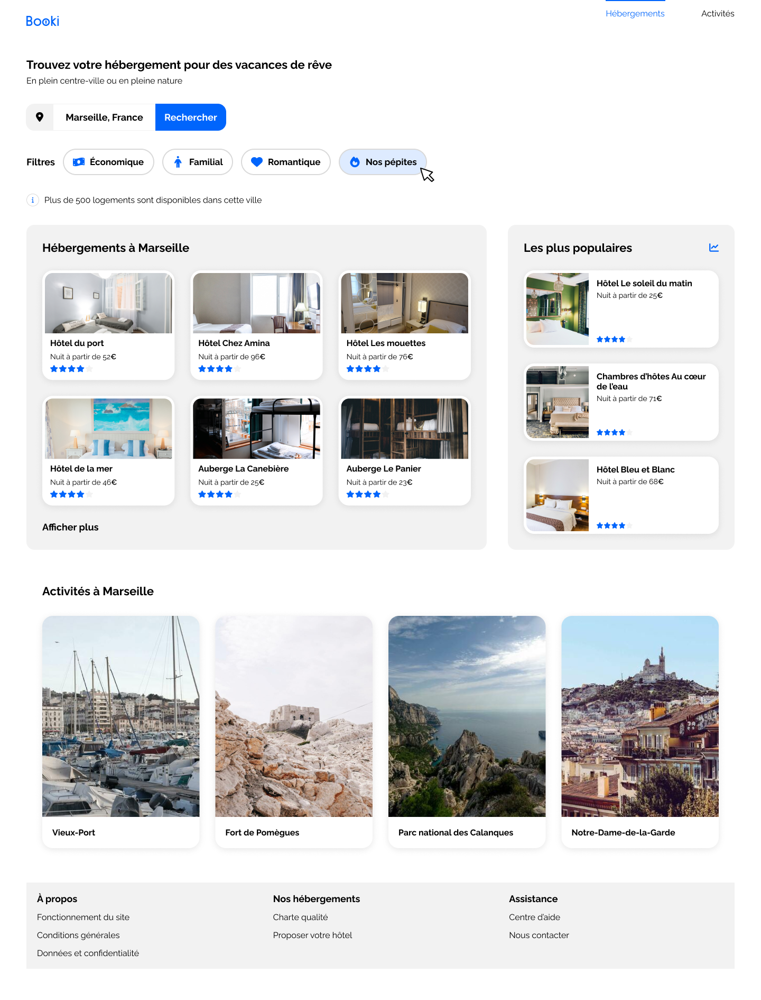

Projet 2 Openclassrooms formation developpeur web.

L’entreprise booki souhaite développer un site Internet qui permette aux usagers de trouver des hébergements et des activités dans la ville de leur choix.
La projet est d'intégrer et de rendre le site responsive, à l'aide de maquettes et avec des spécifications et des contraintes techniques, l'interface du site avec du code HTML et CSS.

Maquettes:
Desktop

Tablette

Mobile

